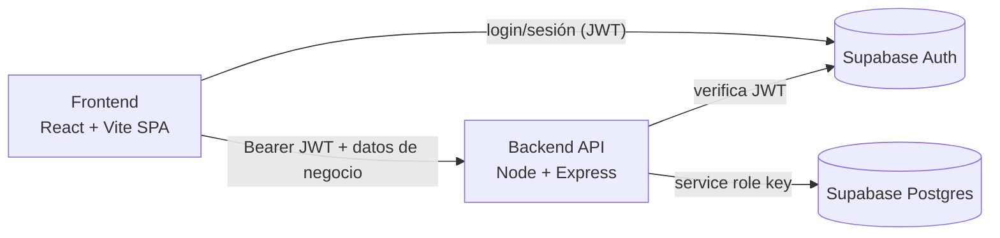
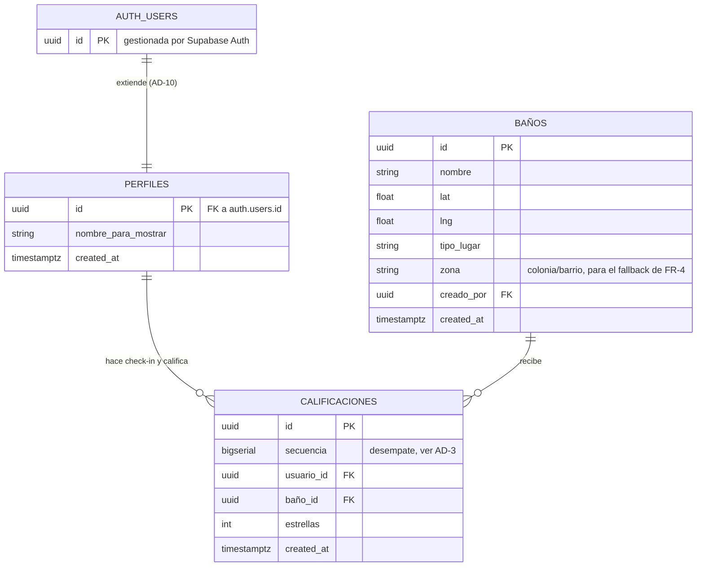

# Architecture Spine — CagApp 2.0

## Design Paradigm

Dos partes independientes que se comunican por HTTP, no un framework full-stack unificado (decisión explícita: el fundador quiere aprender backend como disciplina separada):

- **Frontend** — SPA en React, servida como build estático.
- **Backend** — API REST en **Arquitectura en Capas**: `rutas → controladores → servicios → acceso a datos`. Cada capa solo depende de la de abajo; ninguna capa se salta a otra.
- **Supabase** — proveedor de identidad (Auth) y base de datos (Postgres). No es "backend propio": es infraestructura que tanto el frontend (solo Auth) como el backend (datos de negocio) consumen, cada uno por su puerta distinta (ver AD-1).



## Invariants & Rules

### AD-1 — Límite frontend/backend: Supabase Auth es la única puerta directa del frontend

- **Binds:** todo el frontend, FR-1/FR-2/FR-3 (Cuenta)
- **Prevents:** que el frontend lea o escriba datos de negocio (baños, check-ins, calificaciones) directo contra Supabase, saltándose las reglas del backend (radio de check-in, deduplicación, promedios).
- **Rule:** el frontend solo llama al SDK de Supabase para login/registro/sesión. Cualquier otro dato (baños, calificaciones, check-ins, perfil) se lee o escribe exclusivamente vía la API de Node. El backend es el único que usa la `service role key` de Supabase.

### AD-2 — Dirección de dependencia en el backend

- **Binds:** todo el backend (`/backend`)
- **Prevents:** lógica de negocio filtrándose a controladores o rutas; acceso a datos llamado directo desde una ruta, saltándose la capa de servicios.
- **Rule:** `rutas → controladores → servicios → acceso a datos`. Una capa solo puede llamar a la capa inmediatamente inferior. Ninguna capa importa hacia arriba ni se salta un nivel.

### AD-3 — Las calificaciones son un registro append-only

- **Binds:** FR-9, FR-10, FR-12, entidad `calificaciones`
- **Prevents:** que un builder futuro "simplifique" el modelo actualizando o borrando filas en `calificaciones`, destruyendo el historial que sostiene el activo de datos de largo plazo (ver PRD §Monetización). También previene que dos builders desempaten un timestamp duplicado de formas distintas y obtengan promedios diferentes.
- **Rule:** la tabla `calificaciones` solo recibe `INSERT`. Nunca `UPDATE` ni `DELETE`. Además del `id` (uuid), cada fila lleva una columna `secuencia` (`bigserial`, autoincremental). La "calificación vigente" de un usuario para un baño, y el promedio del baño, se calculan siempre con `ORDER BY created_at DESC, secuencia DESC LIMIT 1` por par `(usuario_id, baño_id)` — el desempate por `secuencia` es obligatorio y elimina la ambigüedad de timestamps idénticos (envíos dobles rápidos). Nunca se cachea en una columna mutable.

### AD-4 — El cálculo de distancia vive una sola vez, en el backend

- **Binds:** FR-7 (radio de 1.5km), FR-9 (radio de 150m)
- **Prevents:** que el frontend y el backend calculen la distancia de formas distintas y lleguen a decisiones distintas de "¿está en rango?"; que FR-7 y FR-9 usen dos implementaciones de Haversine con redondeo distinto y diverjan en el límite exacto.
- **Rule:** existe **una única función** `calcularDistanciaMetros(a, b)` en la capa de servicios (Haversine), y tanto la validación de check-in (FR-9) como la búsqueda de duplicados (FR-7) la importan y llaman — ninguna reimplementa su propia fórmula. El frontend nunca decide por sí mismo si un check-in es válido — solo refleja lo que la API responde.

### AD-5 — Identidad y credenciales viven solo en Supabase Auth

- **Binds:** Usuario, Cuenta, todos los endpoints protegidos
- **Prevents:** que el backend reimplemente su propio manejo de contraseñas/sesiones, o que el frontend tome decisiones de autorización por su cuenta.
- **Rule:** Supabase Auth es la única fuente de identidad. El backend nunca almacena contraseñas; en cada petición protegida, verifica el JWT que Supabase emitió (enviado como `Authorization: Bearer <token>`) para saber quién hace la petición.

### AD-6 — Vocabulario en español en todo el código

- **Binds:** todo (tablas, columnas de dominio, rutas de la API, nombres de variables de dominio)
- **Prevents:** deriva entre nombres en inglés y español que rompa la correspondencia directa con el Glosario del PRD/UX.
- **Rule:** los nombres de **dominio** (tablas, columnas de negocio, campos JSON, rutas) usan los términos en español del Glosario del PRD — `baños`, `calificaciones`, `usuarios`, `perfiles`, `nombre_para_mostrar` — literalmente, sin sinónimos ni traducciones parciales. **Excepción explícita:** las columnas técnicas genéricas de auditoría (`id`, `created_at`, `secuencia` es la única en español porque no tiene convención universal) siguen la convención estándar de Postgres/Supabase en inglés — no son sustantivos de dominio, y Supabase ya las nombra así en sus propias tablas (`auth.users.created_at`).

### AD-7 — Forma de las respuestas de la API

- **Binds:** todos los endpoints de la API
- **Prevents:** que cada endpoint invente su propio formato de éxito/error.
- **Rule:** las respuestas exitosas devuelven el recurso directo como JSON con el código HTTP apropiado (200/201/204). Las respuestas de error devuelven `{ "error": "<mensaje>" }` con un código 4xx/5xx correspondiente. Sin envoltorio `{data: ...}` ni formatos anidados.

### AD-8 — Precisión del GPS: distinguir "fuera de rango" de "no se puede confirmar"

- **Binds:** FR-9
- **Prevents:** que un check-in legítimo se rechace en silencio cuando el GPS del dispositivo no tiene suficiente precisión (común en zonas densas de CDMX o baños en interiores) — este era un requisito que el PRD dejaba pendiente para arquitectura.
- **Rule:** el frontend envía `{ lat, lng, accuracy }` (el campo `accuracy` que da el Geolocation API del navegador, en metros) en cada intento de check-in. El backend calcula la distancia con `accuracy` como margen: si la distancia mínima posible (distancia reportada − `accuracy`) ya excede 150m, responde "fuera de rango"; si `accuracy` es tan grande (> 100m) que no se puede confirmar ni descartar con certeza, responde un error distinto de "precisión insuficiente" — el frontend usa ese código para ofrecer un botón de reintentar en vez de un rechazo definitivo.

### AD-9 — Row Level Security como defensa en profundidad

- **Binds:** tablas `baños`, `calificaciones`, `perfiles`
- **Prevents:** que la API automática de Supabase (PostgREST, accesible con la `anon key` pública que el frontend sí conoce para Auth) quede abierta a lectura/escritura si alguien la consulta directo, ya que el backend usa la `service role key` que ignora RLS por diseño — sin esta regla, dos builders podrían asumir posturas de seguridad distintas (uno confía en RLS, otro asume que Express es la única barrera).
- **Rule:** RLS está **habilitado** en las tres tablas, **sin políticas públicas** (deny-by-default). Solo la `service role key` del backend —que ignora RLS— puede leer o escribir. Ninguna fila es alcanzable con la `anon key` directamente.

### AD-10 — Creación del perfil de usuario

- **Binds:** FR-1, FR-11, entidad `perfiles`
- **Prevents:** que un builder use un trigger de base de datos y otro un endpoint del backend para crear la fila de `perfiles`, generando dos rutas de creación que pueden quedar desincronizadas.
- **Rule:** el frontend primero registra al usuario con el SDK de Supabase Auth; inmediatamente después, llama a `POST /perfiles` (autenticado) en el backend, que crea la fila de `perfiles` con `id = auth.uid()` y el `nombre_para_mostrar` capturado en el formulario de registro. No se usa ningún trigger de Postgres — la creación de este dato de negocio pasa por el backend, consistente con AD-1.

### AD-11 — Forma pública de la lista "Lo que dice la gente" (FR-12)

- **Binds:** FR-12
- **Prevents:** que el endpoint público de calificaciones exponga por accidente un identificador interno (`usuario_id`) u otro campo que Perfil (privado) sí puede mostrarse a sí mismo pero que no debería viajar a otros usuarios.
- **Rule:** el JSON de FR-12 solo incluye `{ nombre_para_mostrar, estrellas, created_at }` por cada calificación — nunca `usuario_id` ni ningún otro identificador. El endpoint de Perfil (FR-11, datos propios) puede incluir más detalle porque solo se sirve al dueño de esos datos.

### AD-12 — Política de contraseñas y expiración de sesión delegadas a Supabase

- **Binds:** FR-1, FR-2
- **Prevents:** que el backend reimplemente su propia política de contraseñas o su propio manejo de expiración/renovación de sesión, duplicando lo que Supabase Auth ya resuelve — el PRD dejaba ambas cosas pendientes para arquitectura.
- **Rule:** la longitud mínima de contraseña y la duración/renovación del JWT de sesión son los valores por defecto de Supabase Auth, sin configuración adicional en el backend. Consistente con AD-5.

### AD-13 — La ubicación del usuario nunca se persiste ni se expone

- **Binds:** FR-9, Constraints and Guardrails / Privacidad del PRD
- **Prevents:** que un builder futuro agregue, por conveniencia, un campo o log que guarde la ubicación cruda del dispositivo más allá del instante de validar el check-in — rompiendo la garantía de privacidad que el PRD confirma como no negociable.
- **Rule:** las coordenadas `{lat, lng, accuracy}` que el frontend envía en un intento de check-in (AD-8) se usan solo en memoria, dentro de esa petición, para calcular la distancia — nunca se escriben en `calificaciones` ni en ninguna otra tabla. Lo único que persiste es el resultado (check-in válido/inválido) y, si es válido, la fila de `calificaciones` (que no tiene columnas de ubicación).

## Consistency Conventions

| Concern | Convention |
| --- | --- |
| Naming (entidades, tablas, rutas) | Español para dominio, ver AD-6. IDs/columnas técnicas en `snake_case` (convención de Postgres/Supabase). |
| Data & formats (ids, fechas, errores) | IDs = `uuid` (default de Supabase) + `secuencia` `bigserial` en `calificaciones` (AD-3). Fechas = `timestamptz` ISO 8601. Errores = `{ "error": string }` (AD-7). Ver AD-11 para la forma pública restringida de FR-12. |
| State & cross-cutting (auth, mutación) | Auth = JWT de Supabase verificado en cada request protegido (AD-5, AD-12). Mutación de calificaciones = solo `INSERT`, nunca `UPDATE`/`DELETE` (AD-3). Seguridad a nivel de fila = RLS deny-by-default (AD-9). |
| Configuración y secretos | La `service role key` de Supabase y demás credenciales viven en variables de entorno: `.env` (excluido de git vía `.gitignore`) en desarrollo local, panel de variables de entorno de Render/Vercel en producción. Nunca se commitea una credencial. |
| Pruebas automatizadas | **Diferido** (ver Deferred) — no hay estrategia de testing definida para el MVP; se prioriza avanzar y aprender. Revisar cuando el código crezca más allá de lo que el propio fundador pueda verificar manualmente. |

## Stack

| Name | Version |
| --- | --- |
| React | 19.3 |
| Vite | 8.3.0 *(corregido tras segunda verificación web — Vite 8.0 salió en marzo 2026; el supuesto inicial de "~7.x" era incorrecto)* |
| Node.js | 24 LTS *(Active LTS actual; Node 22 ya es solo Maintenance LTS)* |
| Express | 5.2.1 |
| @supabase/supabase-js | 2.116.0 |
| Postgres | Gestionado por Supabase (versión que Supabase provisione) |

## Structural Seed

```text
cagapp/
  frontend/          # React + Vite SPA
    src/
      paginas/        # Mapa, Lista, Detalle, CrearBaño, CheckIn, Login, Perfil
      componentes/
      auth/            # cliente de Supabase Auth
  backend/            # API Express
    src/
      rutas/
      controladores/
      servicios/       # logica de negocio: geolocalizacion, deduplicacion, promedios
      datos/           # acceso a Supabase (service role)
```



`AUTH_USERS` es la tabla que Supabase Auth ya gestiona — no se toca directamente. `PERFILES` es la única tabla de dominio propia para datos de usuario, creada explícitamente por el backend tras el registro (AD-10); `nombre_para_mostrar` es el único campo de perfil que este MVP necesita (PRD FR-1, FR-12). `zona` en `BAÑOS` soporta la búsqueda por nombre de zona cuando se niega la geolocalización (FR-4) — un filtro de texto simple (`ILIKE`), sin geocodificación.

## Deployment & Environments

- **Backend (API Express):** Render, plan gratuito (sin tarjeta). El servicio se duerme tras 15 min sin tráfico y tarda realísticamente **30-60 segundos** (no "unos segundos") en despertar en la siguiente petición — esto entra en tensión directa con el NFR de "mapa interactivo en <3s" del PRD. Se acepta como tradeoff conocido del plan gratuito en esta etapa: el objetivo de <3s aplica a peticiones con el servicio ya despierto (uso activo); la primera petición tras 15 min de inactividad es una excepción conocida, no un bug. Si se vuelve un problema real de experiencia, la mitigación (un ping periódico que mantenga el servicio despierto, o subir a un plan pagado) queda en Deferred.
- **Frontend (build de Vite):** Vercel, plan gratuito, despliegue estático. El plan gratuito de Vercel está restringido a uso no comercial — como no hay monetización activa en el MVP (PRD §Monetización) esto no es un problema hoy, pero si CagApp llegara a monetizar habría que revisar el plan.
- **Base de datos / Auth:** Supabase, proyecto en la nube (plan gratuito).
- **Entornos:** un entorno de desarrollo local (Node local + proyecto de Supabase, posiblemente el mismo proyecto de producción dado el alcance de aprendizaje) y un entorno de producción (Render + Vercel + Supabase). No se define un entorno de staging separado — se difiere (ver Deferred).

## Deferred

- **PostGIS / índices geoespaciales** — Haversine en JavaScript basta para la escala de CDMX con cientos de baños; se reconsidera si el volumen de baños crece mucho.
- **Almacenamiento de fotos** (v1.1, fuera de alcance del MVP) — probablemente Supabase Storage, pero no se ha diseñado.
- **Internacionalización (i18n)** — v1 es solo español; no hay estructura de traducciones definida.
- **Gamificación** (v1.1) — insignias/rachas confirmadas como dirección de producto pero sin diseño técnico.
- **Notificaciones push / re-engagement** — explícitamente fuera del espacio de diseño (PRD SM-2 mide retorno orgánico sin notificaciones); no se construye infraestructura de notificaciones en el MVP.
- **Moderación de calificaciones de mala fe** — el PRD acepta el riesgo en v1; no hay mecanismo de reportes/baneos que arquitectura deba soportar todavía.
- **Paginación de "Lo que dice la gente" (FR-12)** — cantidad de entradas y orden no están definidos en el PRD; el backend puede empezar simple (todas las calificaciones, más recientes primero) y ajustar sin romper el contrato de la API si se define después.
- **Observabilidad y CI/CD** — no se definió logging estructurado, monitoreo ni pipeline de despliegue automático; para el alcance actual (proyecto de aprendizaje, despliegue manual a Render/Vercel) no es un divergence real todavía.
- **Entorno de staging separado** — un solo proyecto de Supabase para dev/prod es aceptable al alcance actual; reconsiderar si el riesgo de tocar datos reales se vuelve un problema.
- **Pruebas automatizadas** — sin estrategia definida; se prioriza avanzar y aprender construyendo. Revisar cuando el código crezca más allá de lo verificable a mano.
- **Mantener el backend despierto en Render** — el cold-start de 30-60s tras inactividad es un tradeoff aceptado del plan gratuito (ver Deployment & Environments); un ping periódico (ej. un cron externo gratuito) que evite que se duerma se puede agregar después sin cambiar ninguna Rule de este spine.
